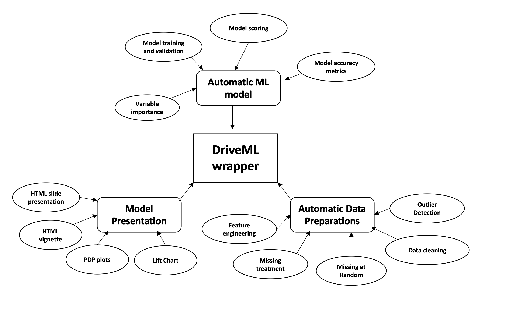
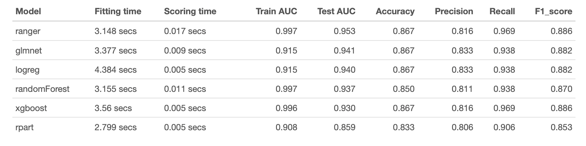
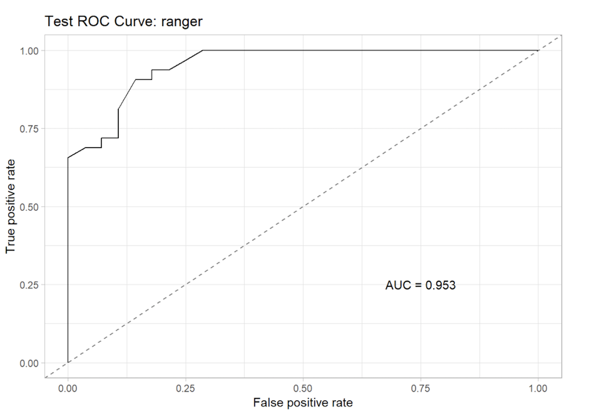
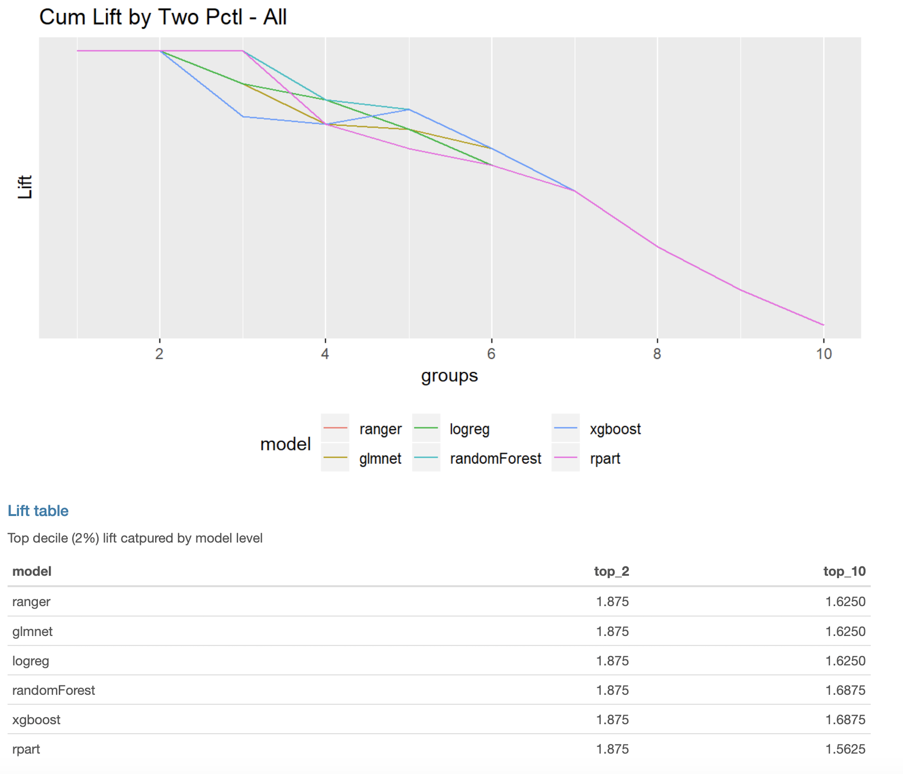
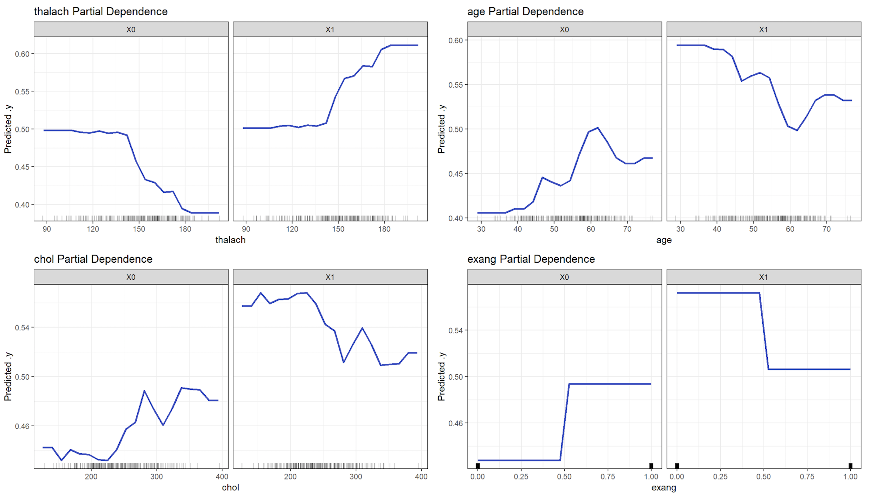

# Summary

In recent years, the concept of automated machine learning has become very popular [@auto:4]. Automated Machine Learning (AutoML) mainly refers to the automated methods for model selection and hyperparameter optimization of various algorithms such as random forests, gradient boosting, neural networks, and more [@auto:2]. The four components of building an automated machine learning pipeline are: (a) Data Preparation, (b) Feature Engineering, (c) Model development, and (d) Model evaluation. Any AutoML pipeline would focus on automating these four components [@auto:1]. In this paper, we introduce a new package named "DriveML" for automated machine learning. DriveML helps in implementing some of the pillars of an automated machine learning pipeline such as automated data preparation, feature engineering, model building, and model explanation by executing simple functions for each purpose instead of writing lengthy R codes. We compare the DriveML package with other relevant packages in CRAN/GitHub and find that DriveML performs the best across different features. We also provide an illustration by applying the DriveML package with the default configuration on a real-world dataset. Overall, the main benefits of DriveML are in development time savings, reduce developer’s errors, optimal tuning of machine learning models, and reproducibility.


# Key Functionality

Figure 1 shows the various functionalities of the DriveML package. DriveML has a single function i.e. "autoDataprep" that performs automatic data preparation steps on the raw input dataset. The various steps involved are: (a) Data cleaning- NA/infinite values are replaced, duplicates are removed and feature names are cleaned, (b) Missing value treatment- such as mean/median imputation or imputation using the MLR package [@R:4], (c) Outlier detection- creating an outlier flag and imputation with 5th or 95th percentile value and (d) Feature engineering- it performs various operations such as missing at random features, Date variable transformation, bulk interactions for numerical features, one-hot encoding for categorical variables and finally, feature selection using zero variance, correlation and Area under the curve (AUC) method. 

{width="5in"}

The "autoMLmodel" function in DriveML performs the various tasks for automated machine learning such as creating model test and train datasets  and  then run multiple classification models such as (i) glmnet- Regularised regression from glmnet R package [@R:10], (ii) logreg- logistic regression from stats R package [@R:11], (iii) randomForest- Random forests using the randomForest R [@R:12], (iv) ranger- Random forests using the ranger R package [@R:13], (v) xgboost- Extreme Gradient boosting using xgboost R package [@R:14] and (vi) rpart- decision tree classification using rpart R package [@R:15].

The other features of the autoMLmodel function are (a) Hyperparameter Tuning- using Random search (default option) or by applying the irace (Iterated Racing for Automatic Algorithm Configuration) package [@irace:1] , (b) performs model validation using Receiver Operating Characteristics Area Under the Curve (ROC AUC), (c) Model scoring and (d) Variable importance chart for the best model (i.e. the one having the highest ROC AUC in the validation dataset). 

The autoMLmodel function will also output the lift chart for the best model and will also provide the Partial dependency plot (PDP plots) for the top five variables from the best model. If the user wants to get the PDP plots for some specific variables, then they can use the function “autoPDP” for the same. The “autoMAR” function is used to identify and generate the Missing at Random features (MAR). The following steps explain the way it works. (1) For every feature X1 in a dataset with missing values, we create a new variable Y1, which will have value of 1 if X1 has a missing value or 0 otherwise, (2) We then fit a classification model with Y1 as the dependent variable and all other features other than X1 as independent variables, (3) If the AUC is high, it means that there is a pattern to the missing values( i.e. they are not missing at random), in this case, we retain Y1 as an additional independent variable in the original dataset, (4) If the AUC is low, then the missing values in X1 are missing at random, then Y1 is dropped, (5) Repeat steps 1 to 4 for all the independent variables in the original dataset and (6) Publish a report with the findings for each independent variable X and additional variables added to the dataset. Apart from this, DriveML can call the SmartEDA [@smarteda:1] package for performing automated exploratory data analysis (EDA). 

Finally, DriveML will provide an HTML vignette report containing the data descriptive statistics, model results, AUC plots, lift charts, and PDP plots.  For example, please see a sample HTML vignette published in CRAN available at <https://cran.r-project.org/web/packages/DriveML/vignettes/SmartML.html>.


# Comparison of DriveML with other relevant R Packages

Table 1 compares the DriveML package with other similar packages available in CRAN/GitHub for automated machine learning namely, OneR [@R:5], H2O [@R:6], SmartML [@R:7] and AutoML [@R:8]. The metric for evaluation is the availability of various desired features for performing automated machine learning such as (a) Fast EDA: Function to provide fast exploratory data analysis report, (b) Auto data-prep: Function for automatic data pre-processing (Removing duplicate entries, handling missing variables, handling outlier variables, one-hot coding, feature engineering, feature reductions using AUC and correlation method), (c) ML models: Function for automatic (without calling multiple functions) Supervised Machine Learning binary classification models, (d) Multi-classification: Function for automatic Supervised Machine Learning Multiclass classification models, (e) Unsupervised ML: Function for automatic Unsupervised Machine Learning models, (f) MAR: Function for identifying missing at random (MAR) variables, (g) Tuning: Function for develop six most used classification algorithms together (XGBoost, Random Forest, glmnet, Logistic regression, Decision tree, Ranger) with hyperparameter tuning, (h) Features: Function to identify the pattern of missing values and generate missing not at random features using GLM method, (i) PDP plots: Model explanation PDP plots, (j) Lift charts: Model explanation Lift charts, and (k) HTML Report: HTML report using rmarkdown. 

We compare DriveML with other relevant packages on the above mentioned characteristics in Table 1.


|                                                 Features                                                 |    |       |     |  Packages    |     |         |        |
|:-------------------------------------------------------------------------------------------------------------------------:|:---------------:|:-----:|:---:|:----:|:---:|:-------:|:------:|
|                                                                                                                           | DriveML        | OneR | H2O | SmartML | AutoML |
| (a) Fast EDA                                                            | Y                      |      |     |         | Y      |
| (b) Auto data-prep                                                                           | Y                         |      | Y   |         | Y      |
| (c) ML models | Y                         | Y    | Y   | Y       | Y      |
| (d) Multi-classification                                  |                |      | Y   |         | Y      |
| (e) Unsupervised ML                                                         |                  |      | Y   |         | Y      |
| (f) MAR                                                                  | Y                  |      |     | Y       |        |
| (g) Tuning                                               | Y                  |      |     | Y       |        |
| (h) Features     | Y                    |      |     |         |        |
| (i) PDP plots                                                                                         | Y                    |      |     | Y       | Y      |
| (j) Lift charts                                                                                       | Y                    |      |     |         |        |
| (k) HTML Report                                                                                          | Y                   |      |     |         |        | 

**Table 1:** Comparison of DriveML with other available R packages

We can see in Table 1 that the current version of DriveML has almost all the desired characteristics mentioned above except the points (d) and (e). These two features would be incorporated in the next release, and we are currently working on it. However, some of the unique and useful functionalities provided by DriveML are to identify, and generate the Missing at Random features (MAR), provide lift charts and HTML report using rmarkdown for presentation (i.e. points (h), (j), and (k) in Figure 2). None of the other packages provide these functionalities. Also, other features such as PDP plots, automated exploratory data analysis, hyper-parameter tuning, and identifying missing at random are not provided by most of the packages altogether. Thus, Table 1 shows that DriveML package is better than most of the other competing packages such as OneR, H2O, SmartML and AutoML.


# Illustration

In this section, we provide an illustration by applying the DriveML package with default configuration on a real world dataset. The purpose of this section is to show how the package DriveML is actually used in practice. We use the Heart disease dataset that is publicly available in the UCI machine learning repository [@R:9]. The target variable is a binary categorical variable that indicates whether a patient has heart disease or not. We apply the DriveML package and it splits the dataset into 243 observations in train and 60 observations in test datasets. Let us read this dataset in R and get a basic overview of the data.


```r
> library("DriveML")
> library("SmartEDA")

## Load sample dataset from ISLR pacakge
> library("ISLR")
> heart = DriveML::heart
```

```r
# Overview of the data - Type = 1
> ExpData(data=heart,type=1)
#Output
                                Descriptions       Obs
1                         Sample size (Nrow)       303
2                    No. of Variables (Ncol)        14
3                   No. of Numeric Variables        14
4                    No. of Factor Variables         0
5                      No. of Text Variables         0
6                   No. of Logical Variables         0
7                      No. of Date Variables         0
8   No. of Zero variance Variables (Uniform)         0
9      %. of Variables having complete cases 100% (14)
10 %. of Variables having <50% missing cases    0% (0)
11 %. of Variables having >50% missing cases    0% (0)
12 %. of Variables having >90% missing cases    0% (0)

# Structure of the data - Type = 2
> ExpData(data=heart,type=2)
#Output
      S.no Variable Name Variable Type    % of Missing     Unique values
1     1           age       integer            0                   41
2     2           sex       integer            0                    2
3     3            cp       integer            0                    4
4     4      trestbps       integer            0                   49
5     5          chol       integer            0                  152
6     6           fbs       integer            0                    2
7     7       restecg       integer            0                    3
8     8       thalach       integer            0                   91
9     9         exang       integer            0                    2
10   10       oldpeak       numeric            0                   40
11   11         slope       integer            0                    3
12   12            ca       integer            0                    5
13   13          thal       integer            0                    4
14   14    target_var       integer            0                    2
```

Now, let us perform data preparation using DriveML.
```r
> dateprep <- autoDataprep(data = heart,
                         target = 'target_var',
                         missimpute = 'default',
                         auto_mar = FALSE,
                         mar_object = NULL,
                         dummyvar = TRUE,
                         char_var_limit = 15,
                         aucv = 0.002,
                         corr = 0.98,
                         outlier_flag = TRUE,
                         uid = NULL,
                         onlykeep = NULL,
                         drop = NULL)

> printautoDataprep(dateprep)
# Output
Data preparation result 
Call:
 autoDataprep(data = heart, target = "target_var", missimpute = "default",      
     auto_mar = FALSE, mar_object = NULL, dummyvar = TRUE, 
     char_var_limit = 15, aucv = 0.002, 
     corr = 0.98, outlier_flag = TRUE, uid = NULL, 
     onlykeep = NULL, drop = NULL) 

 *** Data preparation summary *** 
Total no. of columns available in the data set:  14 
No. of numeric columns:                          8 
No. of factor / character columns:               0 
No. of date columns:                             0 
No. of logical columns:                          0 
No. of unique columns:                           0 
No. of MAR columns:                              0 
No. of dummy variables created:                  0 

 *** Variable reduction *** 
Step 1 - Checked and removed useless variables:         6 
Step 2 - No. of variables before fetature reduction:    22 
Step 3 - No. of zero variance columns (Constant):       0 
Step 4 - No. of high correlated or bijection columns:   3 
Step 5 - No. of low AUC valued columns:                 2 
*Final number of columns considered for ML model:       17 

 *** Data preparation highlights *** 
Missing replaced with { 
--> factor = imputeMode()
--> integer = imputeMean()
--> numeric = imputeMedian()
--> character = imputeMode() } 
```
Now, we will perform automated training, tuning, and validation of the different machine learning models using the "autoMLmodel" function. This function includes six binary classification techniques that were mentioned earlier.

```r
> mymodel <- autoMLmodel( train = heart,
                        test = NULL,
                        target = 'target_var',
                        testSplit = 0.2,
                        tuneIters = 10,
                        tuneType = "random",
                        models = "all",
                        varImp = 10,
                        liftGroup = 50,
                        maxObs = 4000,
                        uid = NULL,
                        htmlreport = FALSE,
                        seed = 1991)
#Output
## autoMLmodel < Test set created >
## autoMLmodel < Binary classification task generated > 
## autoMLmodel < Learners generated > 
## autoMLmodel < Hyper parameters generated > 
## autoMLmodel < Performance metric generated as: auc> 
## autoMLmodel < Tune control generated > 
## autoMLmodel < Validation set generated > 
## autoMLmodel < Training learners > 
## glmnet Model tuning started.... 
## autoMLmodel < All features glmnet tuned and trained > 
## logreg Model tuning started.... 
## autoMLmodel < All features logreg tuned and trained > 
## randomForest Model tuning started.... 
## autoMLmodel < All features randomForest tuned and trained > 
## ranger Model tuning started.... 
## autoMLmodel < All features ranger tuned and trained > 
## xgboost Model tuning started.... 
## autoMLmodel < All features xgboost tuned and trained > 
## rpart Model tuning started.... 
## autoMLmodel < All features rpart tuned and trained > 
## autoMLmodel < DriveML model iteration is completed successfully >

# Model summary results
> mymodel$results
```

The results for the various methods are shown below in Figure 2. We find that the ranger method gives the best result in terms of the Test AUC. We consider the Test AUC as the default evaluation metric in this package. However, the user is free to choose any other evaluation metrics (such as F1 score, Precision, Recall and Accuracy) as well. We also record the model fitting time and the scoring time as shown in Figure 2. 

{width="5in"}

Figure 3 shows the test AUC plot.

```r
> TestROC <- mymodel$trainedModels$randomForest$modelPlots$TestROC
> TestROC
```

{width="5in"}

Finally, we can use the "autoMLReport" function to generate a report in the html format for the output of "autoDataprep" and "autoMLmodel" DriveML functions.
```r
> autoMLReport(mlobject = mymodel, mldata = heart, 
               op_file = "driveML_ouput_heart_data.html")
```

Figures 4 and 5 show the lift chart for all the methods (along with the lift tables) and the partial dependency plots (PDP) for some of the independent variables (such as age- age in years, thalach- maximum heart rate achieved, exang- exercise-induced angina (1 = yes; 0 = no) and chol- serum cholesterol in mg/dl) respectively.

{width="5in"}

{width="5in"}


# Availability

The software is distributed under a GPL-3 file LICENSE (Repository: CRAN) and is available from <https://github.com/daya6489/DriveML>.


# Acknowledgements

We want to thank VMware and the Enterprise and Data Analytics (EDA) leadership for giving us the support for this work. 

# References


